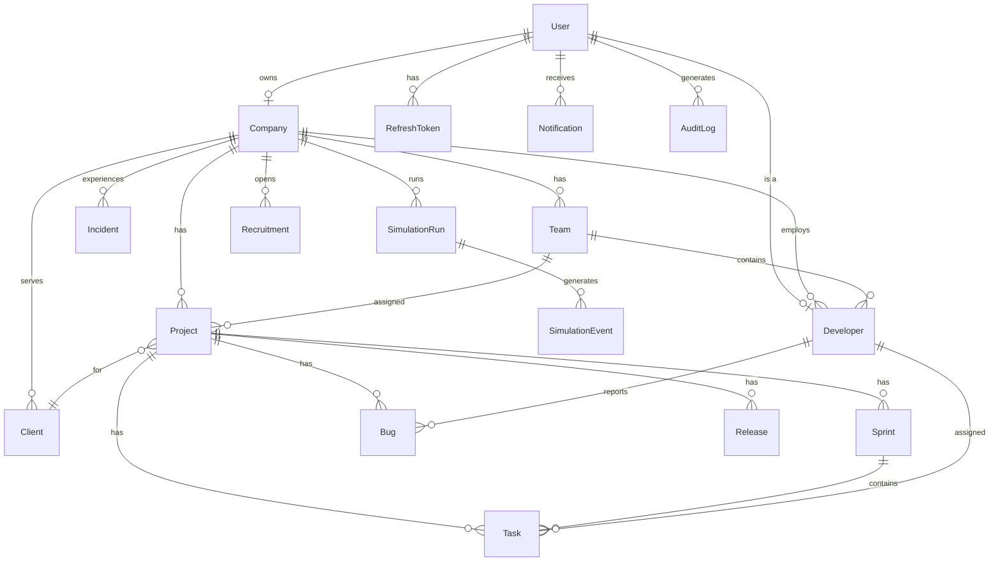

# Schéma de base de données (ERD)

## Vue d'ensemble

Le schéma PostgreSQL est conçu pour être **extensible** et couvrir l'ensemble du domaine métier du simulateur.

## Entités principales



## Tables et cardinalités

| Table | Relations | Index principaux |
|-------|-----------|------------------|
| `users` | 1 Company (owner), 1 Developer, N tokens/notifications | email, role |
| `companies` | 1 owner, N teams/projects/developers | owner_id |
| `teams` | N developers, N projects | company_id |
| `developers` | 1 company, 1 team, N tasks/bugs | company_id, team_id |
| `projects` | 1 company, 1 client, 1 team, N sprints/tasks | company_id, status |
| `sprints` | 1 project, N tasks | project_id, status |
| `tasks` | 1 project, 1 sprint, 1 assignee | project_id, status |
| `bugs` | 1 project, 1 reporter, 1 assignee | project_id, severity |
| `simulation_runs` | 1 company, N events | company_id |
| `simulation_events` | 1 run | run_id, type |
| `audit_logs` | 1 user (optionnel) | entity, created_at |

## Contraintes importantes

- `users.email` : UNIQUE
- `teams(company_id, name)` : UNIQUE composite
- `companies.owner_id` : UNIQUE (1 company par owner)
- Cascade DELETE sur les relations company → enfants

## Migrations

```bash
# Créer une migration
pnpm db:migrate

# Appliquer en production
pnpm --filter @sfs/api db:migrate:prod
```

Le fichier source est `apps/api/prisma/schema.prisma`.
