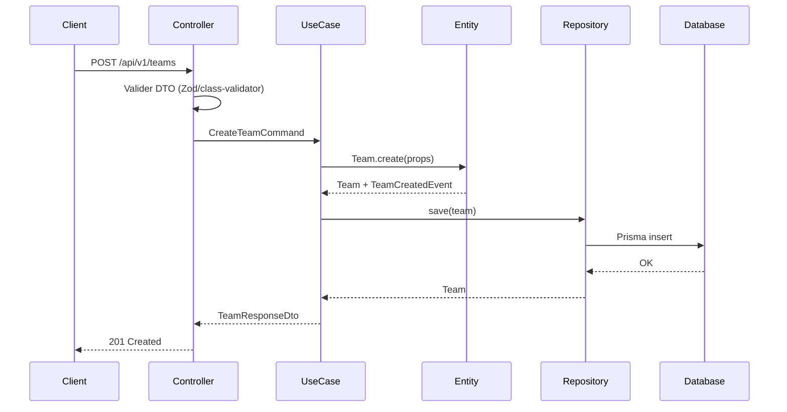

# Architecture — Vue d'ensemble

## Principes directeurs

1. **Clean Architecture** — dépendances pointent vers l'intérieur (Domain au centre)
2. **Domain Driven Design** — le code reflète le langage métier
3. **Feature First** — chaque module métier est autonome
4. **CQRS** — là où lecture/écriture ont des besoins différents (Analytics, Simulation)
5. **Event Driven** — les modules communiquent via des événements de domaine

## Structure du monorepo

```
software-factory-simulator/
│
├── apps/
│   ├── api/                          # Backend NestJS
│   │   └── src/
│   │       ├── modules/              # Feature modules (feature-first)
│   │       │   ├── auth/
│   │       │   ├── companies/
│   │       │   ├── teams/
│   │       │   ├── projects/
│   │       │   ├── simulation/
│   │       │   └── ...
│   │       ├── shared/               # Cross-cutting concerns
│   │       │   ├── domain/           # Base classes, value objects
│   │       │   ├── application/      # Base use cases, interfaces
│   │       │   └── infrastructure/   # Shared infra (DB, cache, queue)
│   │       └── main.ts
│   │
│   └── web/                          # Frontend Next.js
│       └── src/
│           ├── app/                  # App Router pages
│           ├── features/             # Feature-first UI modules
│           ├── shared/               # UI components, hooks, utils
│           └── stores/               # Zustand stores
│
├── packages/
│   └── shared/                       # Types, constants, validators partagés
│
├── docs/
├── docker/
└── .github/
    └── workflows/
```

## Les 4 couches (Backend)

```
┌─────────────────────────────────────────────────┐
│              PRESENTATION                        │
│  Controllers, DTOs, Guards, Filters, WebSockets │
├─────────────────────────────────────────────────┤
│              APPLICATION                         │
│  Use Cases, Commands, Queries, Event Handlers   │
├─────────────────────────────────────────────────┤
│              DOMAIN                              │
│  Entities, Value Objects, Domain Events,        │
│  Repository Interfaces, Domain Services         │
├─────────────────────────────────────────────────┤
│              INFRASTRUCTURE                      │
│  Prisma Repos, Redis, BullMQ, External APIs     │
└─────────────────────────────────────────────────┘
```

### 1. Domain (cœur métier)

**Responsabilité** : Logique métier pure, sans dépendance externe.

| Élément | Rôle | Exemple |
|---------|------|---------|
| **Entity** | Objet avec identité | `Developer`, `Project`, `Sprint` |
| **Value Object** | Objet immuable sans identité | `Email`, `Money`, `SkillLevel` |
| **Aggregate Root** | Point d'entrée d'un agrégat | `Company`, `Team` |
| **Domain Event** | Fait métier survenu | `DeveloperBurnedOut`, `SprintCompleted` |
| **Repository Interface** | Contrat de persistance | `IDeveloperRepository` |
| **Domain Service** | Logique qui ne appartient à aucune entité | `SimulationProbabilityService` |

**Règle** : Aucun import de NestJS, Prisma ou framework.

### 2. Application (orchestration)

**Responsabilité** : Coordonner les use cases, sans logique métier.

| Élément | Rôle | Exemple |
|---------|------|---------|
| **Use Case / Command Handler** | Exécute une action | `HireDeveloperUseCase` |
| **Query Handler** | Lit des données (CQRS) | `GetTeamPerformanceQuery` |
| **Event Handler** | Réagit à un événement | `OnSprintCompletedHandler` |
| **Port (Interface)** | Contrat vers l'extérieur | `INotificationPort` |

**Règle** : Dépend du Domain, jamais de l'Infrastructure directement.

### 3. Infrastructure (implémentations techniques)

**Responsabilité** : Implémenter les interfaces définies dans Domain/Application.

| Élément | Rôle | Exemple |
|---------|------|---------|
| **Repository** | Persistance Prisma | `PrismaDeveloperRepository` |
| **Cache** | Redis | `RedisCacheService` |
| **Queue** | BullMQ jobs | `SimulationJobProcessor` |
| **External** | APIs tierces | `EmailService` |

**Règle** : Implémente les interfaces, ne définit pas la logique métier.

### 4. Presentation (interface utilisateur / API)

**Responsabilité** : Exposer l'application au monde extérieur.

| Élément | Rôle | Exemple |
|---------|------|---------|
| **Controller** | Endpoints REST | `TeamsController` |
| **DTO** | Validation entrée/sortie | `CreateTeamDto` |
| **Guard** | Autorisation | `RolesGuard` |
| **Filter** | Gestion erreurs HTTP | `GlobalExceptionFilter` |
| **Gateway** | WebSocket | `NotificationsGateway` |

**Règle** : Traduit HTTP/WebSocket ↔ Use Cases. Pas de logique métier.

## Structure d'un module feature (exemple : `teams`)

```
modules/teams/
├── domain/
│   ├── entities/
│   │   └── team.entity.ts
│   ├── value-objects/
│   │   └── team-name.vo.ts
│   ├── events/
│   │   └── team-created.event.ts
│   ├── repositories/
│   │   └── team.repository.interface.ts
│   └── services/
│       └── team-capacity.service.ts
├── application/
│   ├── commands/
│   │   ├── create-team.command.ts
│   │   └── create-team.handler.ts
│   ├── queries/
│   │   ├── get-team.query.ts
│   │   └── get-team.handler.ts
│   └── dto/
│       └── team-response.dto.ts
├── infrastructure/
│   ├── persistence/
│   │   └── prisma-team.repository.ts
│   └── mappers/
│       └── team.mapper.ts
├── presentation/
│   ├── teams.controller.ts
│   └── dto/
│       ├── create-team.dto.ts
│       └── update-team.dto.ts
└── teams.module.ts
```

## Flux de données (exemple : créer une équipe)



## Communication inter-modules

Les modules ne s'appellent **pas** directement entre eux. Ils communiquent via :

1. **Domain Events** — `DeveloperHired` → Notification module écoute
2. **Shared Kernel** — types partagés dans `packages/shared`
3. **Application Services** — orchestration cross-module dans la couche Application

## CQRS — Où l'appliquer

| Module | CQRS | Raison |
|--------|------|--------|
| Analytics | Oui | Lectures complexes, agrégations |
| Simulation | Oui | Commands (décisions) vs Queries (état) |
| Reports | Oui | Projections dénormalisées |
| Teams, Projects | Non | CRUD standard suffisant |
| Auth | Non | Pas de besoin de séparation |

## Prochaines étapes

- [ADR 0001 — Monorepo et Clean Architecture](../adr/0001-monorepo-and-clean-architecture.md)
- Schéma base de données → Phase 3
- API REST design → Phase 3
